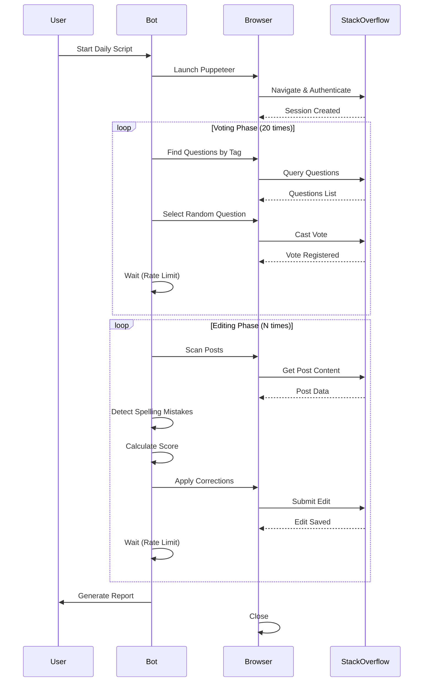

# StackOverBot

A Node.js automation tool for Stack Overflow that performs automated voting, spell-checking, and post editing. Built in 2021 as an educational project to explore web automation and content quality improvement on Stack Overflow.

**⚠️ IMPORTANT:** This project is for educational purposes. Always ensure compliance with Stack Overflow's terms of service, API guidelines, and automation policies before use.

## Features

- 🗳️ Automated voting on questions with specific tags
- ✏️ Spell-checking and grammar correction on posts
- 🔍 Smart detection of mistakes outside code blocks
- 📊 Scoring system for multi-mistake posts
- 🤖 Daily automation combining voting and editing
- 📈 Activity logging and reporting

## Architecture


## Getting Started

### Prerequisites

- Node.js (v14 or higher)
- NPM package manager
- Stack Overflow account (development account recommended for testing)
- Modern web browser (Chrome/Chromium for Puppeteer)

### Installation

1. Clone the repository:
```bash
git clone https://github.com/orassayag/stackoverbot.git
cd stackoverbot
```

2. Install dependencies:
```bash
npm install
```

3. Configure the application (see Configuration section)

4. Run the application:
```bash
npm start
```

## Configuration

Configure the bot behavior in your configuration file:

### Required Settings
- `accountEmail`: Stack Overflow account email
- `accountPassword`: Stack Overflow account password (use environment variables)
- `targetTags`: Array of tags to target for voting
- `voteCount`: Number of votes per run (default: 20)
- `editCount`: Number of posts to edit per run

### Optional Settings
- `delayBetweenActions`: Milliseconds between operations (default: 5000)
- `spellCheckPatterns`: Custom regex patterns for spell checking
- `scoreThreshold`: Minimum score for multi-mistake detection
- `headless`: Run browser in headless mode (default: true)

## Available Scripts

### Vote Script
Performs automated voting on random questions:
```bash
npm run vote
```

### Fix Script
Scans and fixes spelling mistakes on posts:
```bash
npm run fix
```

### Daily Script
Runs daily automation (voting + editing):
```bash
npm run daily
```

### Backup
Creates backup of configuration and data:
```bash
npm run backup
```

## Project Structure

```
stackoverbot/
├── misc/
│   ├── backups/           # Backup files
│   └── documents/         # Planning and task documents
├── src/                   # Source code (to be implemented)
│   ├── scripts/          # Main automation scripts
│   ├── services/         # Business logic
│   ├── utils/            # Utility functions
│   └── config/           # Configuration management
├── README.md
├── CONTRIBUTING.md
├── INSTRUCTIONS.md
├── LICENSE
└── package.json
```

## Workflow Diagram



## Important Ethical Considerations

### Stack Overflow Compliance
This bot must be used responsibly and in compliance with:
- [Stack Overflow Terms of Service](https://stackoverflow.com/legal/terms-of-service)
- [Stack Overflow API Guidelines](https://api.stackexchange.com/docs)
- Community guidelines and best practices

### Best Practices
1. **Test First**: Always test on development accounts for 2-3 weeks
2. **Rate Limiting**: Implement generous delays between operations
3. **Captcha Respect**: Stop automation if captcha appears
4. **Quality Edits**: Only make edits that genuinely improve content
5. **No Spam**: Avoid repetitive or low-quality actions
6. **Transparency**: Consider disclosing bot usage where appropriate

### Legal Notice
Users are responsible for ensuring their use of this tool complies with all applicable laws, terms of service, and community guidelines. The author assumes no liability for misuse.

## Development Status

This project is currently in **planning stage**. The core functionality described in this README is based on the original design specifications found in `misc/documents/todo_tasks.txt`.

## Contributing

Contributions to this project are [released](https://help.github.com/articles/github-terms-of-service/#6-contributions-under-repository-license) to the public under the [project's open source license](LICENSE).

Everyone is welcome to contribute. Contributing doesn't just mean submitting pull requests—there are many different ways to get involved, including answering questions and reporting issues.

Please feel free to contact me with any question, comment, pull-request, issue, or any other thing you have in mind.

## Author

* **Or Assayag** - *Initial work* - [orassayag](https://github.com/orassayag)
* Or Assayag <orassayag@gmail.com>
* GitHub: https://github.com/orassayag
* StackOverflow: https://stackoverflow.com/users/4442606/or-assayag?tab=profile
* LinkedIn: https://linkedin.com/in/orassayag

## License

This application has an MIT license - see the [LICENSE](LICENSE) file for details.
