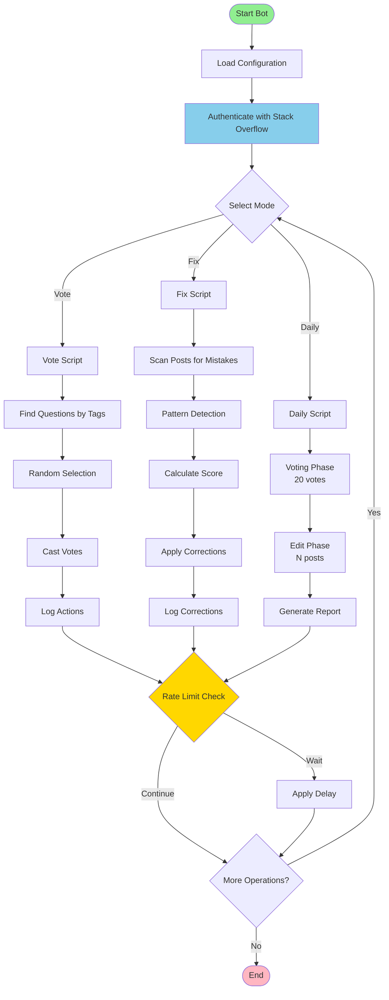
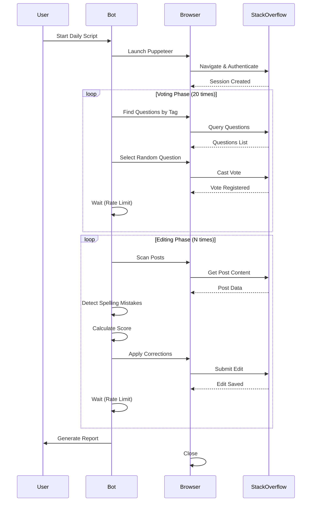

# Stackoverbot

A Node.js automation tool for Stack Overflow that simulates browser-based interactions to improve content quality and explore web automation workflows.

Built in 2021 as an educational project using Puppeteer, it supports automated voting, spell-checking, and post editing. The system includes tag-based question discovery, mistake detection outside code blocks, scoring for multi-error posts, structured logging, and rate-limit aware execution with daily combined workflows for voting and editing tasks.

## Features

- 🗳️ Automated voting on questions with specific tags
- ✏️ Spell-checking and grammar correction on posts
- 🔍 Smart detection of mistakes outside code blocks
- 📊 Scoring system for multi-mistake posts
- 🤖 Daily automation combining voting and editing
- 📈 Activity logging and reporting

### Core Capabilities

- **Automated Voting**: Cast votes on questions with specific tags
- **Spell-Checking**: Correct spelling and grammar on posts
- **Mistake Detection**: Identify errors outside code blocks
- **Scoring System**: Score posts with multiple errors
- **Daily Automation**: Combine voting and editing in daily workflows
- **Activity Logging**: Log all actions for review

### Technical Excellence

- **Browser Automation**: Built with Puppeteer for realistic interactions
- **Rate Limiting**: Respectful execution with delays
- **Structured Logging**: Comprehensive activity tracking
- **Configuration Management**: Flexible setup via config files
- **Testable Design**: Modular architecture for easy testing

### Developer Experience

- **Clear Configuration**: Easy to set up and customize
- **Comprehensive Documentation**: Detailed setup and usage guides
- **Modular Codebase**: Organized for maintainability
- **Ethical Guidelines**: Built-in best practices for responsible use

## Usage

### Interactive Mode (Recommended)

Start the application to access the main menu:

```bash
npm start
```

### Direct Script Execution

Run specific scripts directly:

```bash
# Vote script
npm run vote

# Fix script
npm run fix

# Daily automation script
npm run daily
```

## Architecture

### Architecture Principles

This project follows clean architecture principles:

1. **Separation of Concerns**: Each component has a single responsibility
2. **Modularity**: Code organized into logical modules (scripts, services, utils)
3. **Configuration-Driven**: Behavior controlled via configuration files
4. **Rate Limiting**: Built-in respect for Stack Overflow's limits
5. **Ethical Design**: Prioritizes responsible use of the platform
6. **Testability**: Code structured for easy unit and integration testing



### Design Patterns

- **Strategy Pattern**: Different execution strategies for vote, fix, and daily workflows
- **Factory Pattern**: Dynamic script loading and execution
- **Repository Pattern**: Configuration and data management
- **Observer Pattern**: Logging and event tracking
- **Singleton Pattern**: Configuration and logger instances

### Directory Structure

```
stackoverbot/
├── .github/                # GitHub configuration
│   └── rulesets/           # Repository rules
├── .vscode/                # VS Code settings
├── misc/                   # Miscellaneous files
│   └── documents/          # Planning and task documents
├── src/                    # Source code
│   ├── index.js            # Application entry point
│   ├── scripts/            # Main automation scripts
│   ├── services/           # Business logic
│   ├── utils/              # Utility functions
│   └── config/             # Configuration management
├── .eslintrc               # ESLint configuration
├── .gitignore              # Git ignore rules
├── .prettierrc             # Prettier configuration
├── CHANGELOG.md            # Version history
├── CODE_OF_CONDUCT.md      # Code of conduct
├── CONTRIBUTING.md         # Contribution guidelines
├── INSTRUCTIONS.md         # Detailed usage instructions
├── LICENSE                 # License file
├── README.md               # This file
├── SECURITY.md             # Security policy
└── package.json            # Project dependencies and scripts
```

## Getting Started

### Prerequisites

- Node.js (v14 or higher)
- NPM package manager
- Stack Overflow account (development account recommended for testing)
- Modern web browser (Chrome/Chromium for Puppeteer)

### Installation

1. Clone the repository:

```bash
git clone https://github.com/orassayag/stackoverbot.git
cd stackoverbot
```

2. Install dependencies:

```bash
npm install
```

3. Configure the application (see Configuration section)

4. Run the application:

```bash
npm start
```

## Configuration

Configure the bot behavior in your configuration file:

### Required Settings

- `accountEmail`: Stack Overflow account email
- `accountPassword`: Stack Overflow account password (use environment variables)
- `targetTags`: Array of tags to target for voting
- `voteCount`: Number of votes per run (default: 20)
- `editCount`: Number of posts to edit per run

### Optional Settings

- `delayBetweenActions`: Milliseconds between operations (default: 5000)
- `spellCheckPatterns`: Custom regex patterns for spell checking
- `scoreThreshold`: Minimum score for multi-mistake detection
- `headless`: Run browser in headless mode (default: true)

## Available Scripts

### Vote Script

Performs automated voting on random questions:

```bash
npm run vote
```

### Fix Script

Scans and fixes spelling mistakes on posts:

```bash
npm run fix
```

### Daily Script

Runs daily automation (voting + editing):

```bash
npm run daily
```

### Backup

Creates backup of configuration and data:

```bash
npm run backup
```

## Workflow Diagram



## Important Ethical Considerations

### Stack Overflow Compliance

This bot must be used responsibly and in compliance with:

- [Stack Overflow Terms of Service](https://stackoverflow.com/legal/terms-of-service)
- [Stack Overflow API Guidelines](https://api.stackexchange.com/docs)
- Community guidelines and best practices

### Best Practices

1. **Test First**: Always test on development accounts for 2-3 weeks
2. **Rate Limiting**: Implement generous delays between operations
3. **Captcha Respect**: Stop automation if captcha appears
4. **Quality Edits**: Only make edits that genuinely improve content
5. **No Spam**: Avoid repetitive or low-quality actions
6. **Transparency**: Consider disclosing bot usage where appropriate

### Legal Notice

Users are responsible for ensuring their use of this tool complies with all applicable laws, terms of service, and community guidelines. The author assumes no liability for misuse.

## Development Status

This project is currently in **planning stage**. The core functionality described in this README is based on the original design specifications found in `misc/documents/todo_tasks.txt`.

## Contributing

Contributions to this project are [released](https://help.github.com/articles/github-terms-of-service/#6-contributions-under-repository-license) to the public under the [project's open source license](LICENSE).

Everyone is welcome to contribute. Contributing doesn't just mean submitting pull requests—there are many different ways to get involved, including answering questions and reporting issues.

Please feel free to contact me with any question, comment, pull-request, issue, or any other thing you have in mind.

## Support

For questions, issues, or contributions:

- **GitHub Issues**: [https://github.com/orassayag/stackoverbot/issues](https://github.com/orassayag/stackoverbot/issues)
- **Email**: orassayag@gmail.com

## Author

- **Or Assayag** - _Initial work_ - [orassayag](https://github.com/orassayag)
- Or Assayag <orassayag@gmail.com>
- GitHub: https://github.com/orassayag
- StackOverflow: https://stackoverflow.com/users/4442606/or-assayag?tab=profile
- LinkedIn: https://linkedin.com/in/orassayag

## License

This application has an MIT license - see the [LICENSE](LICENSE) file for details.

## Acknowledgments

- Built for educational and research purposes
- Respects robots.txt and implements rate limiting
- Uses user-agent rotation to avoid detection
- Implements polite crawling practices
